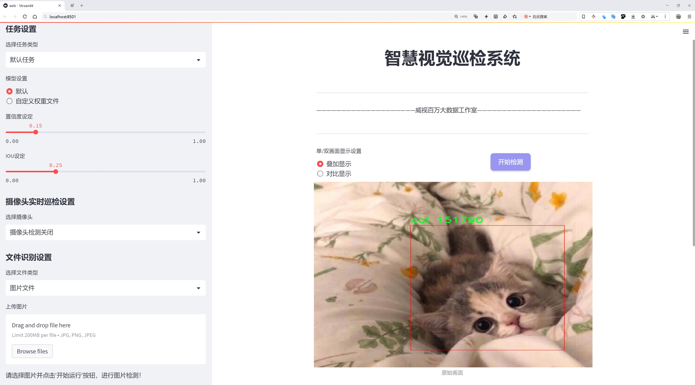
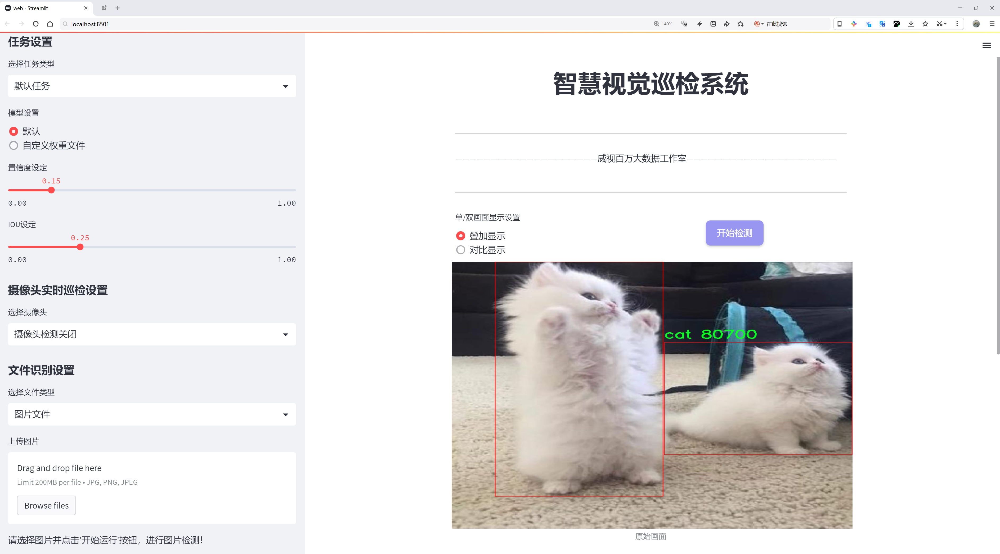
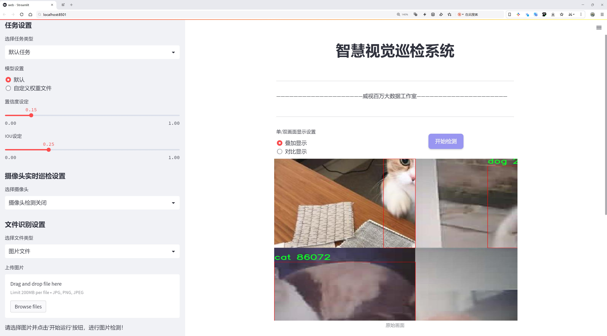
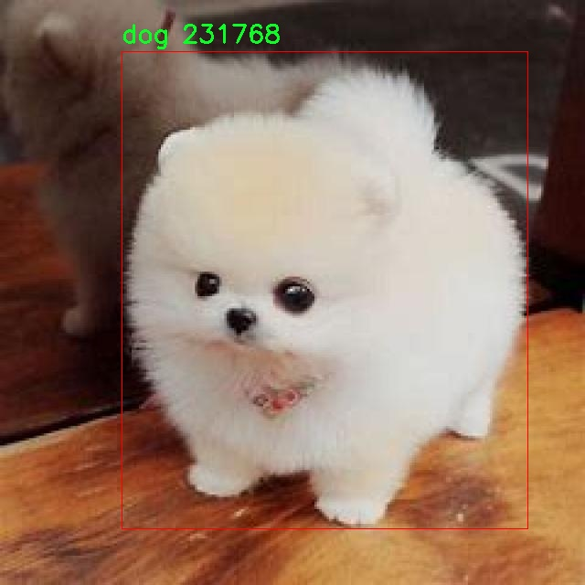
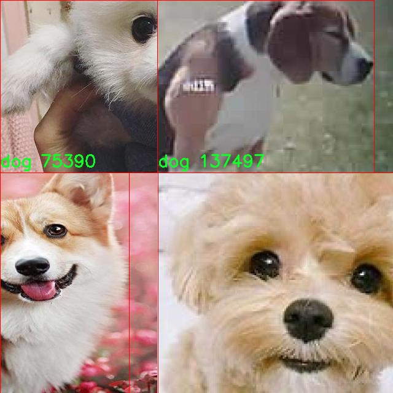
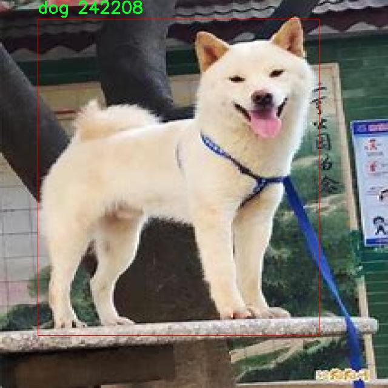
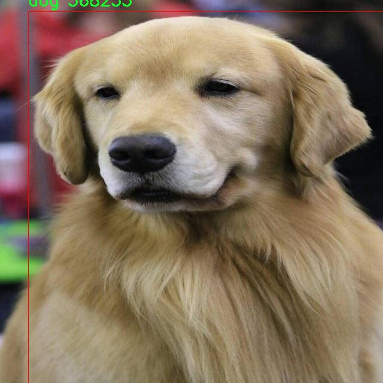
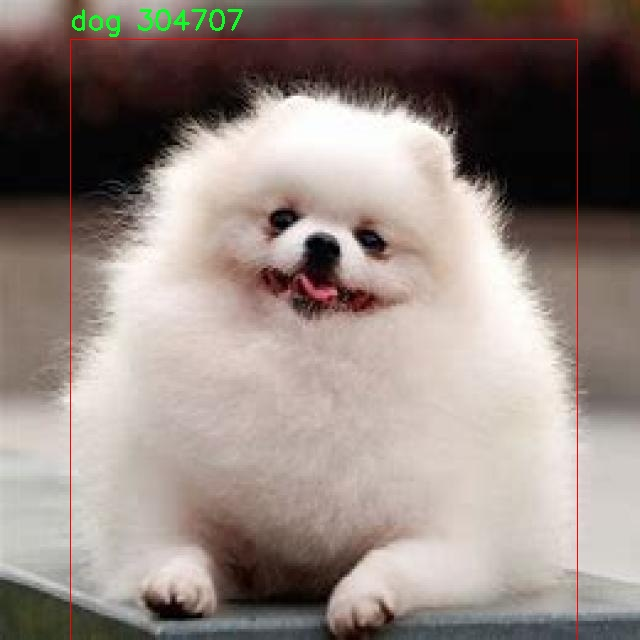

# 动物检测与分类系统源码分享
 # [一条龙教学YOLOV8标注好的数据集一键训练_70+全套改进创新点发刊_Web前端展示]

### 1.研究背景与意义

项目参考[AAAI Association for the Advancement of Artificial Intelligence](https://gitee.com/qunmasj/projects)

项目来源[AACV Association for the Advancement of Computer Vision](https://kdocs.cn/l/cszuIiCKVNis)

研究背景与意义

随着人工智能技术的迅猛发展，计算机视觉领域的研究也取得了显著进展。尤其是在物体检测与分类方面，深度学习算法的应用极大地提升了图像识别的准确性和效率。YOLO（You Only Look Once）系列模型作为一种高效的实时物体检测算法，因其快速性和准确性而广泛应用于各类视觉任务中。YOLOv8作为该系列的最新版本，进一步优化了模型结构和算法性能，使其在处理复杂场景和多类别物体检测时表现更加出色。在此背景下，基于改进YOLOv8的动物检测与分类系统的研究具有重要的理论和实践意义。

动物检测与分类不仅是计算机视觉领域的一个重要应用方向，也是生态保护、动物行为研究以及宠物管理等领域的关键技术。通过高效的动物检测与分类系统，研究人员可以快速获取动物种类及其数量的信息，从而为生态监测和保护提供数据支持。此外，随着宠物经济的快速发展，宠物市场对动物识别技术的需求日益增加。一个高效的动物检测与分类系统可以帮助宠物主人更好地管理和照顾他们的宠物，同时也为宠物相关产品的研发提供了重要的数据基础。

本研究所使用的数据集包含4300张图像，涵盖19个动物类别，包括多种犬种和猫种。这些类别的多样性为模型的训练提供了丰富的样本，有助于提高检测和分类的准确性。通过对这些数据的深入分析和处理，可以有效提升模型在实际应用中的表现。此外，数据集中包含的不同动物种类和图像背景，能够模拟真实世界中的复杂场景，进一步验证模型的鲁棒性和适应性。

在研究过程中，我们将针对YOLOv8模型进行改进，以提高其在动物检测与分类任务中的性能。这包括优化网络结构、调整超参数、引入数据增强技术等，以期在保持实时检测能力的同时，提升模型的准确率和召回率。通过这些改进，我们希望能够构建一个高效、准确的动物检测与分类系统，为相关领域的研究和应用提供有力支持。

综上所述，基于改进YOLOv8的动物检测与分类系统的研究，不仅具有重要的学术价值，还有广泛的应用前景。通过本研究，我们期望能够推动动物检测与分类技术的发展，为生态保护、宠物管理等领域提供创新的解决方案。同时，这一研究也将为后续的计算机视觉研究提供新的思路和方法，促进相关技术的进一步发展与应用。

### 2.图片演示







##### 注意：由于此博客编辑较早，上面“2.图片演示”和“3.视频演示”展示的系统图片或者视频可能为老版本，新版本在老版本的基础上升级如下：（实际效果以升级的新版本为准）

  （1）适配了YOLOV8的“目标检测”模型和“实例分割”模型，通过加载相应的权重（.pt）文件即可自适应加载模型。

  （2）支持“图片识别”、“视频识别”、“摄像头实时识别”三种识别模式。

  （3）支持“图片识别”、“视频识别”、“摄像头实时识别”三种识别结果保存导出，解决手动导出（容易卡顿出现爆内存）存在的问题，识别完自动保存结果并导出到tempDir中。

  （4）支持Web前端系统中的标题、背景图等自定义修改，后面提供修改教程。

  另外本项目提供训练的数据集和训练教程,暂不提供权重文件（best.pt）,需要您按照教程进行训练后实现图片演示和Web前端界面演示的效果。

### 3.视频演示

[3.1 视频演示](https://www.bilibili.com/video/BV1ZU1kYuEQW/)

### 4.数据集信息展示

##### 4.1 本项目数据集详细数据（类别数＆类别名）

nc: 2
names: ['cat', 'dog']


##### 4.2 本项目数据集信息介绍

数据集信息展示

在本研究中，我们采用了名为“animal”的数据集，以改进YOLOv8的动物检测与分类系统。该数据集专注于两种常见的动物类别：猫和狗，具有广泛的应用潜力，尤其是在宠物监控、动物行为分析以及智能家居系统中。数据集的类别数量为2，具体类别包括“cat”（猫）和“dog”（狗）。这两种动物不仅在家庭环境中极为常见，而且它们的行为模式和外观特征具有显著的差异性，这为模型的训练提供了丰富的样本和挑战。

“animal”数据集的构建旨在提供高质量的图像数据，以便在多种环境条件下进行动物检测与分类。数据集中的图像涵盖了不同的拍摄角度、光照条件以及背景环境，确保模型在实际应用中能够具有良好的泛化能力。例如，猫和狗的图像不仅包括静态姿态，还包括动态行为，如奔跑、玩耍和休息等。这种多样性使得模型能够学习到更加全面的特征，从而提高其在实际场景中的识别准确率。

在数据集的标注过程中，研究团队采用了精确的边界框标注技术，以确保每一张图像中的动物都被准确地框定。这一过程不仅提升了数据集的质量，也为后续的模型训练提供了可靠的基础。通过这种方式，YOLOv8模型能够有效地学习到猫和狗的不同特征，例如毛发的颜色、体型的差异以及特定的行为模式。这些特征的提取和学习是实现高效动物检测与分类的关键。

为了进一步增强模型的鲁棒性，数据集还包含了一些经过数据增强处理的图像。这些增强技术包括随机裁剪、旋转、缩放以及颜色变换等，旨在模拟不同的拍摄条件和环境变化。这种处理不仅增加了数据集的多样性，还帮助模型在面对未知环境时，能够保持较高的检测和分类性能。

在训练过程中，我们将“animal”数据集分为训练集和验证集，以便于对模型的性能进行评估。训练集用于模型的学习，而验证集则用于监测模型在未见数据上的表现。通过这种方式，我们能够及时调整模型的参数，优化其性能，确保最终得到一个高效、准确的动物检测与分类系统。

总之，“animal”数据集为改进YOLOv8的动物检测与分类系统提供了坚实的基础。通过对猫和狗这两种动物的深入研究和分析，我们期望能够开发出一个在实际应用中表现优异的智能系统，为宠物管理、动物保护以及相关领域提供有效的技术支持。随着研究的深入，我们相信这一数据集将为未来的动物识别技术的发展开辟新的方向。











### 5.全套项目环境部署视频教程（零基础手把手教学）

[5.1 环境部署教程链接（零基础手把手教学）](https://www.ixigua.com/7404473917358506534?logTag=c807d0cbc21c0ef59de5)


[5.2 安装Python虚拟环境创建和依赖库安装视频教程链接（零基础手把手教学）](https://www.ixigua.com/7404474678003106304?logTag=1f1041108cd1f708b01a)

### 6.手把手YOLOV8训练视频教程（零基础小白有手就能学会）

[6.1 手把手YOLOV8训练视频教程（零基础小白有手就能学会）](https://www.ixigua.com/7404477157818401292?logTag=d31a2dfd1983c9668658)


按照上面的训练视频教程链接加载项目提供的数据集，运行train.py即可开始训练



     Epoch   gpu_mem       box       obj       cls    labels  img_size
     1/200     20.8G   0.01576   0.01955  0.007536        22      1280: 100%|██████████| 849/849 [14:42<00:00,  1.04s/it]
               Class     Images     Labels          P          R     mAP@.5 mAP@.5:.95: 100%|██████████| 213/213 [01:14<00:00,  2.87it/s]
                 all       3395      17314      0.994      0.957      0.0957      0.0843

     Epoch   gpu_mem       box       obj       cls    labels  img_size
     2/200     20.8G   0.01578   0.01923  0.007006        22      1280: 100%|██████████| 849/849 [14:44<00:00,  1.04s/it]
               Class     Images     Labels          P          R     mAP@.5 mAP@.5:.95: 100%|██████████| 213/213 [01:12<00:00,  2.95it/s]
                 all       3395      17314      0.996      0.956      0.0957      0.0845

     Epoch   gpu_mem       box       obj       cls    labels  img_size
     3/200     20.8G   0.01561    0.0191  0.006895        27      1280: 100%|██████████| 849/849 [10:56<00:00,  1.29it/s]
               Class     Images     Labels          P          R     mAP@.5 mAP@.5:.95: 100%|███████   | 187/213 [00:52<00:00,  4.04it/s]
                 all       3395      17314      0.996      0.957      0.0957      0.0845


### 7.70+种全套YOLOV8创新点代码加载调参视频教程（一键加载写好的改进模型的配置文件）

[7.1 70+种全套YOLOV8创新点代码加载调参视频教程（一键加载写好的改进模型的配置文件）](https://www.ixigua.com/7404478314661806627?logTag=29066f8288e3f4eea3a4)

### 8.70+种全套YOLOV8创新点原理讲解（非科班也可以轻松写刊发刊，V10版本正在科研待更新）

#### 由于篇幅限制，每个创新点的具体原理讲解就不一一展开，具体见下列网址中的创新点对应子项目的技术原理博客网址【Blog】：


[8.1 70+种全套YOLOV8创新点原理讲解链接](https://gitee.com/qunmasj/good)

#### 部分改进原理讲解(完整的改进原理见上图和技术博客链接)
### YOLOv8简介

YOLOv8是一种最新的SOTA算法，提供了N/S/M/L/X尺度的不同大小模型，以满足不同场景的需求。本章对算法网络的新特性进行简要介绍。


1）骨干网络和Neck
开发者设计了C2f模块对CSPDarkNet 53和PAFPN进行改造。相比C3模块，C2f模块拥有更多的分支跨层链接，使模型的梯度流更加丰富，显著增强了模型的特征提取能力。
2)Head部分
Head部分采用无锚框设计，将分类任务和回归任务进行了解耦，独立的分支将更加专注于其所负责的特征信息。
3）损失计算
模型使用CIOU Loss作为误差损失函数，并通过最小化DFL进一步提升边界框的回归精度。同时模型采用了TaskAlignedAssigner样本分配策略，以分类得分和IOU的高阶组合作为指标指导正负样本选择，实现了高分类得分和高IOU的对齐，有效地提升了模型的检测精度。


### D-LKA Attention简介
自2010年代中期以来，卷积神经网络（CNNs）已成为许多计算机视觉应用的首选技术。它们能够从原始数据中自动提取复杂的特征表示，无需手动进行特征工程，这引起了医学图像分析社区的极大兴趣。许多成功的CNN架构，如U-Net、全卷积网络、DeepLab或SegCaps（分割胶囊），已经被开发出来。这些架构在语义分割任务中取得了巨大成功，先前的最新方法已经被超越。

在计算机视觉研究中，不同尺度下的目标识别是一个关键问题。在CNN中，可检测目标的大小与相应网络层的感受野尺寸密切相关。如果一个目标扩展到超出这个感受野的边界，这可能会导致欠分割结果。相反，与目标实际大小相比使用过大的感受野可能会限制识别，因为背景信息可能会对预测产生不必要的影响。

解决这个问题的一个有希望的方法涉及在并行使用具有不同尺寸的多个Kernel，类似于Inception块的机制。然而，由于参数和计算要求的指数增长，将Kernel大小增加以容纳更大的目标在实践中受到限制。因此，出现了各种策略，包括金字塔池化技术和不同尺度的扩张卷积，以捕获多尺度的上下文信息。

另一个直观的概念涉及将多尺度图像金字塔或它们的相关特征表示直接纳入网络架构。然而，这种方法存在挑战，特别是在管理训练和推理时间方面的可行性方面存在挑战。在这个背景下，使用编码器-解码器网络，如U-Net，已被证明是有利的。这样的网络在较浅的层中编码外观和位置，而在更深的层中，通过神经元的更广泛的感受野捕获更高的语义信息和上下文信息。

一些方法将来自不同层的特征组合在一起，或者预测来自不同尺寸的层的特征以使用多尺度的信息。此外，出现了从不同尺度的层中预测特征的方法，有效地实现了跨多个尺度的见解整合。然而，大多数编码器-解码器结构面临一个挑战：它们经常无法在不同尺度之间保持一致的特征，并主要使用最后一个解码器层生成分割结果。

语义分割是一项任务，涉及根据预定义的标签集为图像中的每个像素预测语义类别。这项任务要求提取高级特征同时保留初始的空间分辨率。CNNs非常适合捕获局部细节和低级信息，尽管以忽略全局上下文为代价。视觉Transformer（ViT）架构已经成为解决处理全局信息的视觉任务的关键，包括语义分割，取得了显著的成功。

ViT的基础是注意力机制，它有助于在整个输入序列上聚合信息。这种能力使网络能够合并远程的上下文提示，超越了CNN的有限感受野尺寸。然而，这种策略通常会限制ViT有效建模局部信息的能力。这种局限可能会妨碍它们检测局部纹理的能力，这对于各种诊断和预测任务至关重要。这种缺乏局部表示可以归因于ViT模型处理图像的特定方式。

ViT模型将图像分成一系列Patch，并使用自注意力机制来模拟它们之间的依赖关系。这种方法可能不如CNN模型中的卷积操作对感受野内提取局部特征有效。ViT和CNN模型之间的这种图像处理方法的差异可能解释了CNN模型在局部特征提取方面表现出色的原因。

近年来，已经开发出创新性方法来解决Transformer模型内部局部纹理不足的问题。其中一种方法是通过互补方法将CNN和ViT特征结合起来，以结合它们的优势并减轻局部表示的不足。TransUNet是这种方法的早期示例，它在CNN的瓶颈中集成了Transformer层，以模拟局部和全局依赖关系。HiFormer提出了一种解决方案，将Swin Transformer模块和基于CNN的编码器结合起来，生成两个多尺度特征表示，通过Double-Level Fusion模块集成。UNETR使用基于Transformer的编码器和CNN解码器进行3D医学图像分割。CoTr和TransBTS通过Transformer在低分辨率阶段增强分割性能，将CNN编码器和解码器连接在一起。

增强局部特征表示的另一种策略是重新设计纯Transformer模型内部的自注意力机制。在这方面，Swin-Unet在U形结构中集成了一个具有线性计算复杂性的Swin Transformer块作为多尺度 Backbone 。MISSFormer采用高效Transformer来解决视觉Transformer中的参数问题，通过在输入块上进行不可逆的降采样操作。D-Former引入了一个纯Transformer的管道，具有双重注意模块，以分段的方式捕获细粒度的局部注意和与多元单元的交互。然而，仍然存在一些特定的限制，包括计算效率低下，如TransUNet模型所示，对CNN Backbone 的严重依赖，如HiFormer所观察到的，以及对多尺度信息的忽略。

此外，目前的分割架构通常采用逐层处理3D输入 volumetric 的方法，无意中忽视了相邻切片之间的潜在相关性。这一疏忽限制了对 volumetric 信息的全面利用，因此损害了定位精度和上下文集成。此外，必须认识到，医学领域的病变通常在形状上发生变形。因此，用于医学图像分析的任何学习算法都必须具备捕捉和理解这些变形的能力。与此同时，该算法应保持计算效率，以便处理3D volumetric数据。

为了解决上述提到的挑战，作者提出了一个解决方案，即可变形大卷积核注意力模块（Deformable LKA module），它是作者网络设计的基本构建模块。这个模块明确设计成在有效处理上下文信息的同时保留局部描述符。作者的架构在这两个方面的平衡增强了实现精确语义分割的能力。

值得注意的是，参考该博客引入了一种基于数据的感受野的动态适应，不同于传统卷积操作中的固定滤波器Mask。这种自适应方法使作者能够克服与静态方法相关的固有限制。这种创新方法还扩展到了D-LKA Net架构的2D和3D版本的开发。

在3D模型的情况下，D-LKA机制被量身定制以适应3D环境，从而实现在不同 volumetric 切片之间无缝信息交互。最后，作者的贡献通过其计算效率得到进一步强调。作者通过仅依靠D-LKA概念的设计来实现这一点，在各种分割基准上取得了显著的性能，确立了作者的方法作为一种新的SOTA方法。

在本节中，作者首先概述方法论。首先，作者回顾了由Guo等人引入的大卷积核注意力（Large Kernel Attention，LKA）的概念。然后，作者介绍了作者对可变形LKA模块的创新探索。在此基础上，作者介绍了用于分割任务的2D和3D网络架构。

大卷积核提供了与自注意力机制类似的感受野。可以通过使用深度卷积、深度可扩展卷积和卷积来构建大卷积核，从而减少了参数和计算量。构建输入维度为和通道数的卷积核的深度卷积和深度可扩展卷积的卷积核大小的方程如下：


具有卷积核大小和膨胀率。参数数量和浮点运算（FLOPs）的计算如下：


FLOPs的数量与输入图像的大小成线性增长。参数的数量随通道数和卷积核大小的增加而呈二次增长。然而，由于它们通常都很小，因此它们不是限制因素。

为了最小化对于固定卷积核大小K的参数数量，可以将方程3对于膨胀率的导数设定为零：


例如，当卷积核大小为时，结果是。将这些公式扩展到3D情况是直接的。对于大小为和通道数C的输入，3D情况下参数数量和FLOPs 的方程如下：


具有卷积核大小和膨胀。


利用大卷积核进行医学图像分割的概念通过引入可变形卷积得以扩展。可变形卷积可以通过整数偏移自由调整采样网格以进行自由变形。额外的卷积层从特征图中学习出变形，从而创建一个偏移场。基于特征本身学习变形会导致自适应卷积核。这种灵活的卷积核形状可以提高病变或器官变形的表示，从而增强了目标边界的定义。

负责计算偏移的卷积层遵循其相应卷积层的卷积核大小和膨胀。双线性插值用于计算不在图像网格上的偏移的像素值。如图2所示，D-LKA模块可以表示为：


其中输入特征由表示，。表示为注意力图，其中每个值表示相应特征的相对重要性。运算符  表示逐元素乘法运算。值得注意的是，LKA不同于传统的注意力方法，它不需要额外的规范化函数，如或。这些规范化函数往往忽视高频信息，从而降低了基于自注意力的方法的性能。

在该方法的2D版本中，卷积层被可变形卷积所替代，因为可变形卷积能够改善对具有不规则形状和大小的目标的捕捉能力。这些目标在医学图像数据中常常出现，因此这种增强尤为重要。

然而，将可变形LKA的概念扩展到3D领域会带来一定的挑战。主要的约束来自于需要用于生成偏移的额外卷积层。与2D情况不同，由于输入和输出通道的性质，这一层无法以深度可分的方式执行。在3D环境中，输入通道对应于特征，而输出通道扩展到，其中是卷积核的大小。大卷积核的复杂性导致沿第3D的通道数扩展，导致参数和FLOPs大幅增加。因此，针对3D情况采用了另一种替代方法。在现有的LKA框架中，深度卷积之后引入了一个单独的可变形卷积层。这种战略性的设计调整旨在减轻扩展到3D领域所带来的挑战。


2D网络的架构如图1所示。第一变种使用MaxViT作为编码器组件，用于高效特征提取，而第二变种则结合可变形LKA层进行更精细、卓越的分割。

在更正式的描述中，编码器生成4个分层输出表示。首先，卷积干扰将输入图像的维度减小到。随后，通过4个MaxViT块的4个阶段进行特征提取，每个阶段后跟随降采样层。随着过程进展到解码器，实施了4个阶段的D-LKA层，每个阶段包含2个D-LKA块。然后，应用Patch扩展层以实现分辨率上采样，同时减小通道维度。最后，线性层负责生成最终的输出。

2D D-LKA块的结构包括LayerNorm、可变形LKA和多层感知器（MLP）。积分残差连接确保了有效的特征传播，即使在更深层也是如此。这个安排可以用数学方式表示为：


其中输入特征，层归一化LN，可变形LKA注意力，深度卷积，线性层和GeLU激活函数。

3D网络架构如图1所示，采用编码器-解码器设计进行分层结构化。首先，一个Patch嵌入层将输入图像的维度从（）减小到（）。在编码器中，采用了3个D-LKA阶段的序列，每个阶段包含3个D-LKA块。在每个阶段之后，通过降采样步骤将空间分辨率减半，同时将通道维度加倍。中央瓶颈包括另一组2个D-LKA块。解码器结构与编码器相对称。

为了将特征分辨率加倍，同时减少通道数，使用转置卷积。每个解码器阶段都使用3个D-LKA块来促进远距离特征依赖性。最终的分割输出由一个卷积层产生，后面跟随一个卷积层以匹配特定类别的通道要求。

为了建立输入图像和分割输出之间的直接连接，使用卷积形成了一个跳跃连接。额外的跳跃连接根据简单的加法对来自其他阶段的特征进行融合。最终的分割图是通过和卷积层的组合产生的。

3D D-LKA块包括层归一化，后跟D-LKA注意力，应用了残差连接的部分。随后的部分采用了一个卷积层，后面跟随一个卷积层，两者都伴随着残差连接。这个整个过程可以总结如下：


带有输入特征 、层归一化 、可变形 LKA 、卷积层 和输出特征 的公式。是指一个前馈网络，包括2个卷积层和激活函数。

表7显示了普通卷积和构建卷积的参数数量比较。尽管标准卷积的参数数量在通道数较多时急剧增加，但分解卷积的参数总体较低，并且增长速度不那么快。

与分解卷积相比，可变形分解卷积增加了大量参数，但仍然明显小于标准卷积。可变形卷积的主要参数是由偏移网络创建的。在这里，作者假设可变形深度卷积的Kernel大小为（5,5），可变形深度空洞卷积的Kernel大小为（7,7）。这导致了21×21大小的大Kernel的最佳参数数量。更高效地生成偏移量的方法将大大减少参数数量。


值得注意的是，引入可变形LKA确实会增加模型的参数数量和每秒的浮点运算次数（FLOPS）。然而，重要的是强调，这增加的计算负载不会影响作者模型的整体推理速度。

相反，对于Batch-size > 1，作者甚至观察到推理时间的减少，如图7所示。例如，基于作者的广泛实验，作者观察到对于Batch-size为16，具有可变形卷积和没有可变形卷积的推理时间分别为8.01毫秒和17.38毫秒。作者认为这是由于在2D中对可变形卷积的高效实现所致。为了测量时间，使用了大小为（）的随机输入。在GPU热身周期50次迭代之后，网络被推断了1000次。测量是在NVIDIA RTX 3090 GPU上进行的。


为了充分利用性能与参数之间的权衡关系，作者在图8中可视化了在Synapse 2D数据集上报告的DSC和HD性能以及基于参数数量的内存消耗。D-LKA Net引入了相当多的参数，约为101M。这比性能第二好的方法ScaleFormer使用的111.6M参数要少。

与更轻量级的DAEFormer模型相比，作者实现了更好的性能，这证明了参数增加的合理性。大多数参数来自于MaxViT编码器；因此，将编码器替换为更高效的编码器可以减少模型参数。值得注意的是，在此可视化中，作者最初将HD和内存值都归一化到[0, 100]范围内。随后，作者将它们从100缩小，以增强更高值的表示。


### 9.系统功能展示（检测对象为举例，实际内容以本项目数据集为准）

图9.1.系统支持检测结果表格显示

  图9.2.系统支持置信度和IOU阈值手动调节

  图9.3.系统支持自定义加载权重文件best.pt(需要你通过步骤5中训练获得)

  图9.4.系统支持摄像头实时识别

  图9.5.系统支持图片识别

  图9.6.系统支持视频识别

  图9.7.系统支持识别结果文件自动保存

  图9.8.系统支持Excel导出检测结果数据


### 10.原始YOLOV8算法原理

原始YOLOv8算法原理

YOLOv8作为YOLO系列的最新版本，继承并发展了前几代模型的优点，尤其是在目标检测的精度和速度方面。与传统的anchor-based检测方法相比，YOLOv8采用了anchor-free的设计理念，这一创新使得模型在处理复杂场景时，尤其是小目标的检测上表现得更加出色。YOLOv8的核心在于其高效的网络结构和智能的特征提取机制，这些都为其在实时目标检测任务中提供了强大的支持。

在YOLOv8的架构中，输入端首先对图像进行预处理，包括Mosaic数据增强、自适应图像缩放和灰度填充等步骤。这些预处理方法旨在提高模型的鲁棒性和泛化能力，使其能够更好地适应不同的环境和目标特征。然而，YOLOv8在训练的最后阶段停止使用Mosaic数据增强，以避免对数据真实分布的破坏，从而确保模型学习到的特征更加有效。

YOLOv8的主干网络是其性能的关键组成部分。该网络采用了C2f模块替代了传统的C3模块，C2f模块通过引入更多的跳层连接，能够更好地捕捉到丰富的梯度流信息。这种设计不仅提升了特征提取的效率，还保证了模型的轻量化，减少了计算资源的消耗。此外，YOLOv8依然保留了SPPF（Spatial Pyramid Pooling Fast）结构，这一结构在保证效果的同时，显著降低了执行时间。

在Neck端，YOLOv8采用了基于PAN（Path Aggregation Network）的设计，通过上采样、下采样和特征拼接等操作，对不同尺度的特征图进行融合。这种特征融合策略使得模型能够更好地理解和定位不同大小的目标，尤其是在复杂背景下的小目标检测上，提升了整体的检测性能。

YOLOv8的输出端采用了解耦头（Decoupled Head）结构，这一结构将分类和回归任务分开处理，分别提取类别和位置特征。由于分类任务和定位任务的侧重点不同，解耦设计使得模型在训练时能够更有效地收敛，从而提高预测的精度。此外，YOLOv8引入了无锚框结构，直接预测目标的中心位置，并使用任务对齐学习（Task-Aligned Learning）方法来优化正负样本的匹配过程。这一创新使得模型在处理复杂场景时，能够更好地平衡分类和定位的精度。

在损失函数的设计上，YOLOv8采用了BCE（Binary Cross-Entropy）损失函数来计算分类损失，而回归损失则使用了DFL（Distribution Focal Loss）和CIoU（Complete Intersection over Union）损失函数。这种组合不仅提高了模型的泛化能力，还增强了其在小目标检测中的表现。

尽管YOLOv8在多个方面进行了优化，但在复杂水面环境下，模型仍然面临一些挑战。例如，小目标漂浮物的特征复杂，背景多样化，导致YOLOv8在这些场景中的定位误差和目标感知能力不足。为了解决这些问题，研究者们提出了YOLOv8-WSSOD算法的改进方案。该方案通过引入BiFormer双层路由注意力机制，构建C2fBF模块，以减轻主干网络下采样过程中的噪声影响，保留更细粒度的上下文信息，从而提升模型对小目标的感知能力。

此外，YOLOv8-WSSOD还在Neck端引入了GSConv和Slim-neck技术，这些技术旨在保持模型的精度同时降低计算量，进一步提高了检测速度和效率。最后，YOLOv8-WSSOD使用MPDIoU损失函数替代CIoU损失函数，增强了模型的泛化能力和精准度，使其在复杂环境下的表现更加出色。

综上所述，YOLOv8通过一系列创新和优化，在目标检测领域展现了强大的能力。其anchor-free的设计理念、高效的特征提取机制和智能的损失函数选择，使得YOLOv8在实时性和准确性之间达到了良好的平衡。尽管在特定环境下仍存在一些挑战，但通过不断的改进和优化，YOLOv8及其衍生版本有望在未来的应用中发挥更大的作用。


### 11.项目核心源码讲解（再也不用担心看不懂代码逻辑）

#### 11.1 ui.py

以下是代码的核心部分，并附上详细的中文注释：

```python
import sys
import subprocess

def run_script(script_path):
    """
    使用当前 Python 环境运行指定的脚本。

    Args:
        script_path (str): 要运行的脚本路径

    Returns:
        None
    """
    # 获取当前 Python 解释器的路径
    python_path = sys.executable

    # 构建运行命令，使用 streamlit 运行指定的脚本
    command = f'"{python_path}" -m streamlit run "{script_path}"'

    # 执行命令
    result = subprocess.run(command, shell=True)
    
    # 检查命令执行的返回码，如果不为0则表示出错
    if result.returncode != 0:
        print("脚本运行出错。")

# 实例化并运行应用
if __name__ == "__main__":
    # 指定要运行的脚本路径
    script_path = "web.py"  # 这里可以直接使用相对路径

    # 调用函数运行脚本
    run_script(script_path)
```

### 代码分析与注释：

1. **导入模块**：
   - `import sys`：用于访问与 Python 解释器紧密相关的变量和函数。
   - `import subprocess`：用于执行外部命令和程序。

2. **定义 `run_script` 函数**：
   - 该函数接受一个参数 `script_path`，表示要运行的 Python 脚本的路径。
   - 使用 `sys.executable` 获取当前 Python 解释器的路径，以确保使用正确的 Python 环境来运行脚本。
   - 构建一个命令字符串，使用 `streamlit` 运行指定的脚本。
   - 使用 `subprocess.run` 执行构建的命令，并通过 `shell=True` 允许在 shell 中执行命令。
   - 检查命令的返回码，如果返回码不为0，表示脚本运行出错，打印错误信息。

3. **主程序入口**：
   - 使用 `if __name__ == "__main__":` 确保该代码块仅在直接运行脚本时执行，而不是作为模块导入时执行。
   - 指定要运行的脚本路径 `script_path`，这里可以直接使用相对路径。
   - 调用 `run_script` 函数来执行指定的脚本。

通过以上分析和注释，可以清晰地理解代码的核心功能和实现逻辑。

这个文件是一个 Python 脚本，主要功能是运行一个名为 `web.py` 的脚本，使用的是当前 Python 环境中的 Streamlit 库。首先，文件导入了必要的模块，包括 `sys`、`os` 和 `subprocess`，以及一个自定义的 `abs_path` 函数，用于获取脚本的绝对路径。

在 `run_script` 函数中，首先获取当前 Python 解释器的路径，这样可以确保在正确的环境中运行脚本。接着，构建一个命令字符串，该命令使用 `streamlit run` 来运行指定的脚本路径。`subprocess.run` 函数用于执行这个命令，`shell=True` 参数表示在一个新的 shell 中执行命令。

如果脚本运行出现错误，`result.returncode` 将不等于 0，程序会打印出“脚本运行出错。”的提示信息。

在文件的最后部分，使用 `if __name__ == "__main__":` 语句来确保当该文件作为主程序运行时，以下代码才会被执行。这里指定了要运行的脚本路径，即 `web.py`，并调用 `run_script` 函数来执行它。

总的来说，这个脚本的主要作用是方便地在当前 Python 环境中运行一个 Streamlit 应用，确保路径正确并处理可能的错误。

#### 11.2 70+种YOLOv8算法改进源码大全和调试加载训练教程（非必要）\ultralytics\utils\tuner.py

以下是经过简化和注释的核心代码部分：

```python
import subprocess
from ultralytics.utils import LOGGER, NUM_THREADS
from ray import tune
from ray.air import RunConfig
from ray.tune.schedulers import ASHAScheduler
from ray.air.integrations.wandb import WandbLoggerCallback

def run_ray_tune(model, space: dict = None, grace_period: int = 10, gpu_per_trial: int = None, max_samples: int = 10, **train_args):
    """
    使用 Ray Tune 进行超参数调优。

    参数:
        model (YOLO): 要进行调优的模型。
        space (dict, optional): 超参数搜索空间，默认为 None。
        grace_period (int, optional): ASHA 调度器的宽限期（以 epoch 为单位），默认为 10。
        gpu_per_trial (int, optional): 每个试验分配的 GPU 数量，默认为 None。
        max_samples (int, optional): 要运行的最大试验次数，默认为 10。
        train_args (dict, optional): 传递给 `train()` 方法的其他参数，默认为 {}。

    返回:
        (dict): 包含超参数搜索结果的字典。
    """

    LOGGER.info('💡 Learn about RayTune at https://docs.ultralytics.com/integrations/ray-tune')

    # 安装 Ray Tune
    subprocess.run('pip install ray[tune]'.split(), check=True)

    # 定义默认的超参数搜索空间
    default_space = {
        'lr0': tune.uniform(1e-5, 1e-1),  # 初始学习率
        'lrf': tune.uniform(0.01, 1.0),   # 最终学习率
        'momentum': tune.uniform(0.6, 0.98),  # 动量
        'weight_decay': tune.uniform(0.0, 0.001),  # 权重衰减
        # 其他超参数...
    }

    # 将模型放入 Ray 存储中
    model_in_store = ray.put(model)

    def _tune(config):
        """
        使用指定的超参数和其他参数训练 YOLO 模型。

        参数:
            config (dict): 用于训练的超参数字典。

        返回:
            None.
        """
        model_to_train = ray.get(model_in_store)  # 从 Ray 存储中获取模型
        model_to_train.reset_callbacks()  # 重置回调
        config.update(train_args)  # 更新训练参数
        results = model_to_train.train(**config)  # 训练模型
        return results.results_dict  # 返回结果字典

    # 获取搜索空间
    if not space:
        space = default_space  # 如果没有提供搜索空间，则使用默认空间

    # 定义可训练函数并分配资源
    trainable_with_resources = tune.with_resources(_tune, {'cpu': NUM_THREADS, 'gpu': gpu_per_trial or 0})

    # 定义 ASHA 调度器
    asha_scheduler = ASHAScheduler(time_attr='epoch', metric='metric_name', mode='max', max_t=100, grace_period=grace_period)

    # 定义回调
    tuner_callbacks = [WandbLoggerCallback(project='YOLOv8-tune')] if wandb else []

    # 创建 Ray Tune 超参数搜索调优器
    tuner = tune.Tuner(trainable_with_resources, param_space=space, tune_config=tune.TuneConfig(scheduler=asha_scheduler, num_samples=max_samples), run_config=RunConfig(callbacks=tuner_callbacks))

    # 运行超参数搜索
    tuner.fit()

    # 返回超参数搜索结果
    return tuner.get_results()
```

### 代码注释说明：
1. **导入模块**：导入必要的库和模块，包括 Ray Tune 和相关的调度器、回调等。
2. **函数定义**：`run_ray_tune` 函数用于执行超参数调优，接收模型和其他参数。
3. **安装 Ray Tune**：通过 `subprocess` 安装 Ray Tune 库。
4. **默认超参数空间**：定义了一个包含多个超参数的字典，供调优使用。
5. **模型存储**：将模型放入 Ray 的存储中，以便在调优过程中使用。
6. **训练函数**：`_tune` 函数用于训练模型，接收超参数配置并返回训练结果。
7. **搜索空间处理**：如果没有提供搜索空间，则使用默认的超参数空间。
8. **资源分配**：定义可训练函数并指定 CPU 和 GPU 的资源分配。
9. **调度器和回调**：定义 ASHA 调度器和可选的 Wandb 回调，用于记录训练过程。
10. **创建调优器**：使用 Ray Tune 创建调优器并运行超参数搜索。
11. **返回结果**：返回调优的结果字典。

该程序文件是一个用于YOLOv8模型超参数调优的工具，主要利用Ray Tune库来实现。首先，程序导入了一些必要的模块和配置，包括超参数搜索空间、日志记录器和线程数等。接着，定义了一个名为`run_ray_tune`的函数，该函数接收多个参数，包括要调优的模型、超参数搜索空间、GPU分配、最大样本数等。

在函数内部，首先记录了一条信息，提示用户了解Ray Tune的文档。接着，程序尝试安装Ray Tune库，如果安装失败，则抛出模块未找到的异常。然后，程序检查是否安装了WandB（Weights and Biases）库，以便进行实验跟踪。

接下来，定义了一个默认的超参数搜索空间，包括学习率、动量、权重衰减、图像增强参数等。然后，将模型放入Ray的存储中，以便在调优过程中使用。

程序中定义了一个内部函数`_tune`，该函数接收超参数配置，并使用这些参数训练YOLO模型。训练完成后，返回结果字典。

函数接着检查是否提供了超参数搜索空间，如果没有，则使用默认空间，并发出警告。然后，从训练参数中获取数据集信息，并确保数据集参数被正确设置。

接下来，程序定义了一个可训练的函数，并为其分配资源。使用ASHAScheduler来调度超参数搜索，并定义回调函数以便在调优过程中记录结果。

最后，创建一个Ray Tune的超参数搜索调优器，并运行调优过程。完成后，返回调优结果。整个程序的设计旨在简化YOLOv8模型的超参数调优过程，提高模型训练的效率和效果。

#### 11.3 70+种YOLOv8算法改进源码大全和调试加载训练教程（非必要）\ultralytics\models\rtdetr\model.py

```python
# Ultralytics YOLO 🚀, AGPL-3.0 license
"""
RT-DETR接口，基于视觉变换器的实时目标检测器。RT-DETR提供实时性能和高准确性，
在CUDA和TensorRT等加速后端中表现出色。它具有高效的混合编码器和IoU感知查询选择，
以提高检测准确性。

有关RT-DETR的更多信息，请访问：https://arxiv.org/pdf/2304.08069.pdf
"""

from ultralytics.engine.model import Model  # 导入基础模型类
from ultralytics.nn.tasks import RTDETRDetectionModel  # 导入RT-DETR检测模型

from .predict import RTDETRPredictor  # 导入预测器
from .train import RTDETRTrainer  # 导入训练器
from .val import RTDETRValidator  # 导入验证器


class RTDETR(Model):
    """
    RT-DETR模型接口。该基于视觉变换器的目标检测器提供实时性能和高准确性。
    支持高效的混合编码、IoU感知查询选择和可调的推理速度。

    属性:
        model (str): 预训练模型的路径。默认为'rtdetr-l.pt'。
    """

    def __init__(self, model='rtdetr-l.pt') -> None:
        """
        使用给定的预训练模型文件初始化RT-DETR模型。支持.pt和.yaml格式。

        参数:
            model (str): 预训练模型的路径。默认为'rtdetr-l.pt'。

        异常:
            NotImplementedError: 如果模型文件扩展名不是'pt'、'yaml'或'yml'。
        """
        # 检查模型文件的扩展名是否有效
        if model and model.split('.')[-1] not in ('pt', 'yaml', 'yml'):
            raise NotImplementedError('RT-DETR仅支持从*.pt、*.yaml或*.yml文件创建。')
        # 调用父类的初始化方法
        super().__init__(model=model, task='detect')

    @property
    def task_map(self) -> dict:
        """
        返回RT-DETR的任务映射，将任务与相应的Ultralytics类关联。

        返回:
            dict: 一个字典，将任务名称映射到RT-DETR模型的Ultralytics任务类。
        """
        return {
            'detect': {
                'predictor': RTDETRPredictor,  # 预测器类
                'validator': RTDETRValidator,  # 验证器类
                'trainer': RTDETRTrainer,      # 训练器类
                'model': RTDETRDetectionModel   # RT-DETR检测模型类
            }
        }
``` 

### 代码核心部分说明：
1. **类定义**：`RTDETR`类继承自`Model`，表示RT-DETR模型的接口。
2. **初始化方法**：`__init__`方法用于初始化模型，检查输入的模型文件格式是否有效。
3. **任务映射**：`task_map`属性返回一个字典，映射了检测任务与相应的处理类（预测、验证、训练）。

该程序文件是关于百度的RT-DETR模型的接口实现，RT-DETR是一种基于视觉变换器（Vision Transformer）的实时目标检测器，旨在提供高效的实时性能和高准确度，特别是在使用CUDA和TensorRT等加速后端时表现优异。该模型采用了高效的混合编码器和IoU（Intersection over Union）感知查询选择机制，以提高检测的准确性。

文件中首先导入了必要的模块，包括Ultralytics库中的模型类和任务类。接着定义了一个名为RTDETR的类，该类继承自Ultralytics的Model类，作为RT-DETR模型的接口。RTDETR类的构造函数接受一个参数`model`，该参数是预训练模型的路径，默认值为'rtdetr-l.pt'。在构造函数中，程序会检查提供的模型文件的扩展名是否为支持的格式（.pt、.yaml或.yml），如果不符合，则抛出一个`NotImplementedError`异常。

RTDETR类还定义了一个名为`task_map`的属性，该属性返回一个字典，映射了与RT-DETR模型相关的任务名称及其对应的Ultralytics类。这些任务包括预测（predictor）、验证（validator）和训练（trainer），以及与之相关的RTDETR模型类RTDETRDetectionModel。

总体而言，该文件提供了RT-DETR模型的基本框架和接口，方便用户进行目标检测任务的实现和调用。通过这个接口，用户可以利用RT-DETR模型进行高效的目标检测，同时也可以根据需要进行模型的训练和验证。

#### 11.4 train.py

以下是经过简化和注释的核心代码部分，主要保留了与YOLO检测模型训练相关的功能：

```python
import random
import numpy as np
import torch.nn as nn
from ultralytics.data import build_dataloader, build_yolo_dataset
from ultralytics.engine.trainer import BaseTrainer
from ultralytics.models import yolo
from ultralytics.nn.tasks import DetectionModel
from ultralytics.utils import LOGGER, RANK
from ultralytics.utils.torch_utils import de_parallel, torch_distributed_zero_first

class DetectionTrainer(BaseTrainer):
    """
    基于检测模型的训练类，继承自BaseTrainer类。
    """

    def build_dataset(self, img_path, mode="train", batch=None):
        """
        构建YOLO数据集。

        参数:
            img_path (str): 包含图像的文件夹路径。
            mode (str): 模式，`train`表示训练模式，`val`表示验证模式。
            batch (int, optional): 批量大小，默认为None。
        """
        gs = max(int(de_parallel(self.model).stride.max() if self.model else 0), 32)  # 获取模型的最大步幅
        return build_yolo_dataset(self.args, img_path, batch, self.data, mode=mode, rect=mode == "val", stride=gs)

    def get_dataloader(self, dataset_path, batch_size=16, rank=0, mode="train"):
        """构造并返回数据加载器。"""
        assert mode in ["train", "val"]  # 确保模式合法
        with torch_distributed_zero_first(rank):  # 在分布式训练中，仅初始化一次数据集
            dataset = self.build_dataset(dataset_path, mode, batch_size)
        shuffle = mode == "train"  # 训练模式下打乱数据
        workers = self.args.workers if mode == "train" else self.args.workers * 2  # 设置工作线程数
        return build_dataloader(dataset, batch_size, workers, shuffle, rank)  # 返回数据加载器

    def preprocess_batch(self, batch):
        """对图像批次进行预处理，包括缩放和转换为浮点数。"""
        batch["img"] = batch["img"].to(self.device, non_blocking=True).float() / 255  # 转换为浮点数并归一化
        if self.args.multi_scale:  # 如果启用多尺度
            imgs = batch["img"]
            sz = (
                random.randrange(self.args.imgsz * 0.5, self.args.imgsz * 1.5 + self.stride)
                // self.stride
                * self.stride
            )  # 随机选择新的图像大小
            sf = sz / max(imgs.shape[2:])  # 计算缩放因子
            if sf != 1:
                ns = [
                    math.ceil(x * sf / self.stride) * self.stride for x in imgs.shape[2:]
                ]  # 计算新的形状
                imgs = nn.functional.interpolate(imgs, size=ns, mode="bilinear", align_corners=False)  # 进行插值缩放
            batch["img"] = imgs
        return batch

    def get_model(self, cfg=None, weights=None, verbose=True):
        """返回YOLO检测模型。"""
        model = DetectionModel(cfg, nc=self.data["nc"], verbose=verbose and RANK == -1)  # 创建检测模型
        if weights:
            model.load(weights)  # 加载权重
        return model

    def plot_training_samples(self, batch, ni):
        """绘制训练样本及其注释。"""
        plot_images(
            images=batch["img"],
            batch_idx=batch["batch_idx"],
            cls=batch["cls"].squeeze(-1),
            bboxes=batch["bboxes"],
            paths=batch["im_file"],
            fname=self.save_dir / f"train_batch{ni}.jpg",
            on_plot=self.on_plot,
        )

    def plot_metrics(self):
        """从CSV文件中绘制指标。"""
        plot_results(file=self.csv, on_plot=self.on_plot)  # 保存结果图
```

### 代码说明：
1. **类定义**：`DetectionTrainer`类继承自`BaseTrainer`，用于实现YOLO模型的训练。
2. **数据集构建**：`build_dataset`方法根据输入路径和模式构建YOLO数据集，支持训练和验证模式。
3. **数据加载器**：`get_dataloader`方法创建数据加载器，确保在分布式训练中只初始化一次数据集。
4. **批处理预处理**：`preprocess_batch`方法对图像批次进行预处理，包括归一化和可选的多尺度处理。
5. **模型获取**：`get_model`方法返回YOLO检测模型，并可选择加载预训练权重。
6. **绘图功能**：`plot_training_samples`和`plot_metrics`方法用于可视化训练样本和训练指标。

这个程序文件 `train.py` 是一个用于训练 YOLO（You Only Look Once）目标检测模型的实现，基于 Ultralytics 提供的框架。文件中定义了一个名为 `DetectionTrainer` 的类，该类继承自 `BaseTrainer`，并专门用于处理目标检测任务。

在类的构造中，首先定义了 `build_dataset` 方法，该方法用于构建 YOLO 数据集。它接收图像路径、模式（训练或验证）和批次大小作为参数，并根据模型的步幅（stride）构建数据集。`get_dataloader` 方法则负责创建数据加载器，确保在分布式训练时只初始化一次数据集，并根据模式设置是否打乱数据。

`preprocess_batch` 方法用于对输入的图像批次进行预处理，包括将图像缩放到合适的大小并转换为浮点数格式。`set_model_attributes` 方法用于设置模型的属性，如类别数量和类别名称。

`get_model` 方法用于返回一个 YOLO 检测模型，并可以加载预训练权重。`get_validator` 方法返回一个用于模型验证的 `DetectionValidator` 实例，包含损失名称的定义。

`label_loss_items` 方法用于返回一个包含训练损失项的字典，方便在训练过程中进行监控。`progress_string` 方法则返回一个格式化的字符串，显示训练进度，包括当前的 epoch、GPU 内存使用情况和损失值。

`plot_training_samples` 方法用于绘制训练样本及其标注，便于可视化训练过程中的数据。最后，`plot_metrics` 和 `plot_training_labels` 方法分别用于绘制训练过程中的指标和创建带标签的训练图，帮助用户分析模型的训练效果。

整体来看，这个文件实现了 YOLO 模型训练的各个环节，从数据加载、预处理到模型训练和结果可视化，提供了一个完整的训练框架。

#### 11.5 code\ultralytics\models\rtdetr\__init__.py

以下是代码中最核心的部分，并附上详细的中文注释：

```python
# 导入RTDETR模型、预测器和验证器
from .model import RTDETR  # 导入RTDETR模型类
from .predict import RTDETRPredictor  # 导入RTDETR预测器类
from .val import RTDETRValidator  # 导入RTDETR验证器类

# 定义模块的公开接口，包含RTDETR模型、预测器和验证器
__all__ = "RTDETRPredictor", "RTDETRValidator", "RTDETR"
```

### 注释说明：
1. **导入模块**：
   - `from .model import RTDETR`：从当前包的`model`模块中导入`RTDETR`类，这个类通常用于定义模型的结构和参数。
   - `from .predict import RTDETRPredictor`：从当前包的`predict`模块中导入`RTDETRPredictor`类，这个类用于对输入数据进行预测，输出模型的推理结果。
   - `from .val import RTDETRValidator`：从当前包的`val`模块中导入`RTDETRValidator`类，这个类用于验证模型的性能，通常包括计算准确率、召回率等指标。

2. **定义公开接口**：
   - `__all__`：这是一个特殊变量，用于定义当使用`from module import *`时，哪些对象会被导入。这里定义了三个对象：`RTDETRPredictor`、`RTDETRValidator`和`RTDETR`，表示这些是模块的核心功能部分。

这个程序文件是一个Python模块的初始化文件，通常用于定义模块的公共接口。在这个特定的文件中，主要涉及到与RTDETR（实时目标检测模型）相关的几个组件。

首先，文件的开头有一行注释，提到这是Ultralytics YOLO（一个流行的目标检测框架）的一部分，并声明了其使用的AGPL-3.0许可证。这意味着该代码是开源的，并且在遵循许可证条款的情况下可以自由使用和修改。

接下来，文件通过相对导入的方式引入了三个类：`RTDETR`、`RTDETRPredictor`和`RTDETRValidator`。这些类分别定义在同一模块的不同文件中。`RTDETR`类可能是模型的核心实现，负责模型的结构和训练；`RTDETRPredictor`类则可能用于模型的预测功能，处理输入数据并返回检测结果；而`RTDETRValidator`类则可能用于模型的验证，评估模型在验证集上的表现。

最后，`__all__`变量被定义为一个包含字符串的元组，列出了模块的公共接口。这意味着当使用`from module import *`的方式导入这个模块时，只会导入`RTDETRPredictor`、`RTDETRValidator`和`RTDETR`这三个类。这是一种封装机制，确保用户只能访问模块中指定的部分，避免直接访问内部实现细节。

总体来说，这个文件的主要作用是组织和暴露与RTDETR相关的功能，使得其他模块可以方便地使用这些功能。

#### 11.6 70+种YOLOv8算法改进源码大全和调试加载训练教程（非必要）\ultralytics\models\yolo\pose\predict.py

以下是经过简化和注释的核心代码部分：

```python
# 导入必要的模块和类
from ultralytics.engine.results import Results
from ultralytics.models.yolo.detect.predict import DetectionPredictor
from ultralytics.utils import DEFAULT_CFG, LOGGER, ops

class PosePredictor(DetectionPredictor):
    """
    PosePredictor类，继承自DetectionPredictor类，用于基于姿态模型的预测。
    """

    def __init__(self, cfg=DEFAULT_CFG, overrides=None, _callbacks=None):
        """初始化PosePredictor，设置任务为'pose'并记录使用'mps'作为设备的警告。"""
        super().__init__(cfg, overrides, _callbacks)  # 调用父类构造函数
        self.args.task = 'pose'  # 设置任务类型为姿态检测
        # 检查设备类型，如果是'mps'，则发出警告
        if isinstance(self.args.device, str) and self.args.device.lower() == 'mps':
            LOGGER.warning("WARNING ⚠️ Apple MPS known Pose bug. Recommend 'device=cpu' for Pose models. "
                           'See https://github.com/ultralytics/ultralytics/issues/4031.')

    def postprocess(self, preds, img, orig_imgs):
        """对给定输入图像或图像列表返回检测结果。"""
        # 使用非极大值抑制处理预测结果
        preds = ops.non_max_suppression(preds,
                                        self.args.conf,  # 置信度阈值
                                        self.args.iou,   # IOU阈值
                                        agnostic=self.args.agnostic_nms,  # 是否类别无关的NMS
                                        max_det=self.args.max_det,  # 最大检测数量
                                        classes=self.args.classes,  # 目标类别
                                        nc=len(self.model.names))  # 类别数量

        # 如果输入图像不是列表，则将其转换为numpy数组
        if not isinstance(orig_imgs, list):
            orig_imgs = ops.convert_torch2numpy_batch(orig_imgs)

        results = []  # 存储结果的列表
        for i, pred in enumerate(preds):  # 遍历每个预测结果
            orig_img = orig_imgs[i]  # 获取原始图像
            # 调整预测框的坐标到原始图像的尺度
            pred[:, :4] = ops.scale_boxes(img.shape[2:], pred[:, :4], orig_img.shape).round()
            # 获取关键点预测并调整其坐标
            pred_kpts = pred[:, 6:].view(len(pred), *self.model.kpt_shape) if len(pred) else pred[:, 6:]
            pred_kpts = ops.scale_coords(img.shape[2:], pred_kpts, orig_img.shape)
            img_path = self.batch[0][i]  # 获取图像路径
            # 将结果存储到Results对象中
            results.append(
                Results(orig_img, path=img_path, names=self.model.names, boxes=pred[:, :6], keypoints=pred_kpts))
        return results  # 返回所有结果
```

### 代码说明：
1. **PosePredictor类**：这是一个用于姿态检测的预测器，继承自`DetectionPredictor`类。
2. **初始化方法**：在构造函数中，设置任务类型为“pose”，并检查设备类型以防止在Apple MPS上出现已知的姿态检测问题。
3. **后处理方法**：`postprocess`方法用于处理模型的预测结果，包括：
   - 应用非极大值抑制（NMS）来过滤重叠的检测框。
   - 将预测框和关键点的坐标调整到原始图像的尺度。
   - 将处理后的结果存储在`Results`对象中，并返回这些结果。

该程序文件是Ultralytics YOLO框架中的一个模块，主要用于基于姿态模型进行预测。文件中的`PosePredictor`类继承自`DetectionPredictor`类，专门处理与姿态估计相关的任务。

在文件开头，首先导入了一些必要的模块和类，包括`Results`、`DetectionPredictor`和一些工具函数。`PosePredictor`类的定义中包含了一个文档字符串，提供了如何使用该类的示例代码。示例展示了如何通过指定模型和数据源来创建`PosePredictor`的实例，并调用`predict_cli`方法进行预测。

在`__init__`方法中，`PosePredictor`类被初始化，设置任务为“pose”，并且如果设备被设置为“mps”（即Apple的Metal Performance Shaders），则会发出警告，建议使用“cpu”作为设备，因为在使用“mps”时可能会遇到已知的姿态模型问题。

`postprocess`方法负责处理预测结果。它首先对预测结果应用非极大值抑制（NMS），以过滤掉低置信度的检测框。接着，方法检查输入图像是否为列表，如果不是，则将其转换为NumPy数组。随后，针对每一张图像的预测结果，进行坐标缩放，以适应原始图像的尺寸，并提取关键点信息。最后，将处理后的结果封装到`Results`对象中，并返回这些结果。

总体来说，该文件实现了一个用于姿态估计的预测器，包含了初始化、预测和后处理的功能，适用于YOLOv8模型的姿态检测任务。

### 12.系统整体结构（节选）

### 整体功能和构架概括

该项目是一个基于YOLOv8的目标检测和姿态估计框架，包含多个模块和工具，旨在提供高效的模型训练、预测和调优功能。整体架构包括模型定义、数据处理、训练流程、预测接口以及可视化工具等。主要功能包括：

1. **模型训练**：提供了训练YOLOv8模型的工具，支持超参数调优和模型验证。
2. **模型预测**：实现了目标检测和姿态估计的预测功能，支持多种输入格式和后处理方法。
3. **超参数调优**：利用Ray Tune库进行模型超参数的自动调优，提升模型性能。
4. **数据处理**：提供数据集构建和加载的功能，支持图像预处理和增强。
5. **可视化**：支持训练过程中的指标可视化和结果展示，便于用户分析和调试。

### 文件功能整理表

| 文件路径                                                                 | 功能描述                                                     |
|------------------------------------------------------------------------|----------------------------------------------------------|
| `C:\shangjia\code\ui.py`                                               | 运行Streamlit应用，提供用户界面以启动YOLOv8模型。                |
| `C:\shangjia\code\70+种YOLOv8算法改进源码大全和调试加载训练教程（非必要）\ultralytics\utils\tuner.py` | 实现YOLOv8模型的超参数调优，使用Ray Tune库进行自动化调优。       |
| `C:\shangjia\code\70+种YOLOv8算法改进源码大全和调试加载训练教程（非必要）\ultralytics\models\rtdetr\model.py` | 定义RT-DETR模型的接口，提供模型结构和基本功能。                   |
| `C:\shangjia\code\train.py`                                           | 处理YOLO模型的训练流程，包括数据加载、预处理和训练监控。          |
| `C:\shangjia\code\70+种YOLOv8算法改进源码大全和调试加载训练教程（非必要）\ultralytics\models\rtdetr\__init__.py` | 初始化RT-DETR模块，定义公共接口，导入相关类。                     |
| `C:\shangjia\code\70+种YOLOv8算法改进源码大全和调试加载训练教程（非必要）\ultralytics\models\yolo\pose\predict.py` | 实现姿态估计的预测功能，处理输入数据并返回检测结果。              |
| `C:\shangjia\code\ultralytics\solutions\heatmap.py`                  | 生成热图以可视化模型的检测结果，辅助分析模型性能。                 |
| `C:\shangjia\code\model.py`                                           | 可能包含模型的定义和训练逻辑，具体功能需进一步分析。               |
| `C:\shangjia\code\ultralytics\trackers\byte_tracker.py`              | 实现ByteTracker，用于目标跟踪，支持多目标检测场景。                 |
| `C:\shangjia\code\ultralytics\utils\callbacks\__init__.py`          | 初始化回调模块，定义回调函数的公共接口。                          |
| `C:\shangjia\code\ultralytics\utils\callbacks\dvc.py`               | 实现与DVC（数据版本控制）相关的回调功能，支持模型训练的版本管理。   |
| `C:\shangjia\code\ultralytics\utils\patches.py`                     | 可能包含对模型或数据处理的补丁和扩展功能，具体功能需进一步分析。     |
| `C:\shangjia\code\70+种YOLOv8算法改进源码大全和调试加载训练教程（非必要）\ultralytics\trackers\__init__.py` | 初始化跟踪模块，定义公共接口，导入相关类。                          |

以上表格总结了每个文件的主要功能，帮助理解整个项目的结构和各个模块之间的关系。

注意：由于此博客编辑较早，上面“11.项目核心源码讲解（再也不用担心看不懂代码逻辑）”中部分代码可能会优化升级，仅供参考学习，完整“训练源码”、“Web前端界面”和“70+种创新点源码”以“13.完整训练+Web前端界面+70+种创新点源码、数据集获取”的内容为准。

### 13.完整训练+Web前端界面+70+种创新点源码、数据集获取


# [下载链接：https://mbd.pub/o/bread/ZpyWmZdp](https://mbd.pub/o/bread/ZpyWmZdp)